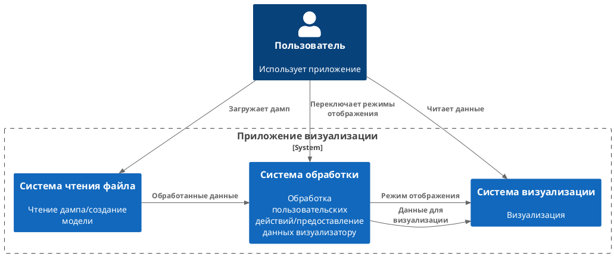
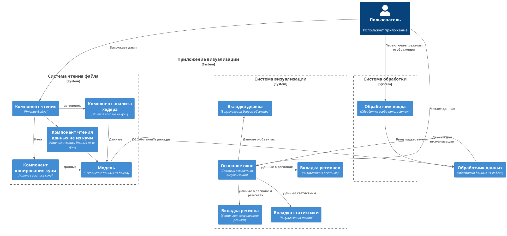

# Context

```plantuml
@startuml
!include <C4/C4_Context>

HIDE_STEREOTYPE()

Person(User, "Пользователь", "Использует приложение")


System_Boundary(App, "Приложение визуализации",) {
	System(Reader, "Система чтения файла", "Чтение дампа/создание модели")
	System(Processor, "Система обработки", "Обработка пользовательских действий/предоставление данных визуализатору")
	System(Visualizer, "Система визуализации", "Визуализация")
	

	Rel_R(Reader, Processor, "Обработанные данные")
	Rel_L(Processor, Visualizer, "Данные для визуализации")
	Rel_L(Processor, Visualizer, "Режим отображения")
}

Rel(User, Reader, "Загружает дамп")
Rel(User, Processor, "Переключает режимы отображения")
Rel(User, Visualizer, "Читает данные")

@enduml
```

# Component

```plantuml
@startuml
!include <C4/C4_Component>

HIDE_STEREOTYPE()

Person(User, "Пользователь", "Использует приложение")


System_Boundary(App, "Приложение визуализации",) {
	System_Boundary(ReaderB, "Система чтения файла"){
		Container(Reader, "Компонент чтения", "Чтение файла")
		Container(ReaderHeader, "Компонент анализа хедера", "Чтение заголовка кучи")
		Container(ReaderHeap, "Компонент копирования кучи", "Чтение и запись кучи")
		Container(ReaderInternal, "Компонент чтения данных не из кучи", "Чтение и запись данных не из кучи")
		Container(Model, "Модель", "Сохранение данных из дампа")
		
		Rel_R(Reader, ReaderHeader, "заголовок")
		Rel_D(Reader, ReaderHeap, "Куча")
		Rel_R(Reader, ReaderInternal, "Данные не из кучи")
        Rel_D(ReaderHeader, Model, "Данные")
	    Rel_R(ReaderHeap, Model, "Данные")
        Rel_R(ReaderInternal, Model, "Данные")
    }
	System_Boundary(ProcessorB, "Система обработки"){
        Container(DataProcessor, "Обработчик данных", "Обработка данных из модели")
        Container(InputHandler, "Обработчик ввода", "Обработка ввода пользователя")

        Rel_D(InputHandler, DataProcessor, "Ввод пользователя")
    }

	Rel_R(Model, DataProcessor, "Обработанные данные")

	System_Boundary(VisualizerB, "Система визуализации"){
        Container(PageChoser, "Основное окно", "Главный компонент визуализации")
        Container(PageTree, "Вкладка дерева", "Визуализация дерева объектов")
        Container(PageRegions, "Вкладка регионов", "Визуализация регионов")
        Container(PageRegion, "Вкладка региона", "Детальная визуализация региона")
        Container(PageStats, "Вкладка статистики", "Визуализация топов")
		
        Rel_U(PageChoser, PageTree, "Данные о объектах")
        Rel_R(PageChoser, PageRegions, "Данные о регионах")
        Rel_D(PageChoser, PageRegion, "Данные о регионе и ремсетах")
        Rel_D(PageChoser, PageStats, "Данные статистики")
		
    }
	

	Rel_R(DataProcessor, PageChoser, "Данные для визуализации")
}

Rel_D(User, Reader, "Загружает дамп")
Rel_D(User, InputHandler, "Переключает режимы отображения")
Rel_D(User, PageChoser, "Читает данные")

@enduml
```

