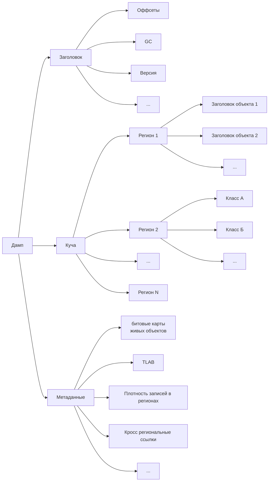

```mermaid
graph LR
	Dump[Дамп]
	Dump --> Header[Заголовок]
	Dump --> Heap[Куча]
	Dump --> Internal[Метаданные]
	
	Header --> Offsets[Оффсеты]
	Header --> GC
	Header --> Version[Версия]
	Header --> A[...]
	
	Heap --> Region1[Регион 1]
	Heap --> Region2[Регион 2]
	Heap --> B[...]
	Heap --> RegionN[Регион N]
	
	Region1 --> ObjectHeader1[Заголовок объекта 1]
	Region1 --> ObjectHeader2[Заголовок объекта 2]
	Region1 --> B1[...]
	Region2 --> ClassA[Класс А]
	Region2 --> ClassB[Класс Б]
	Region2 --> B2[...]
	
	Internal --> livebitmap[битовые карты<br>живых объектов]
	Internal --> TLAB
	Internal --> CardTable[Плотность записей в регионах]
	Internal --> RemSet[Кросс региональные ссылки]
	Internal --> C[...]
```

