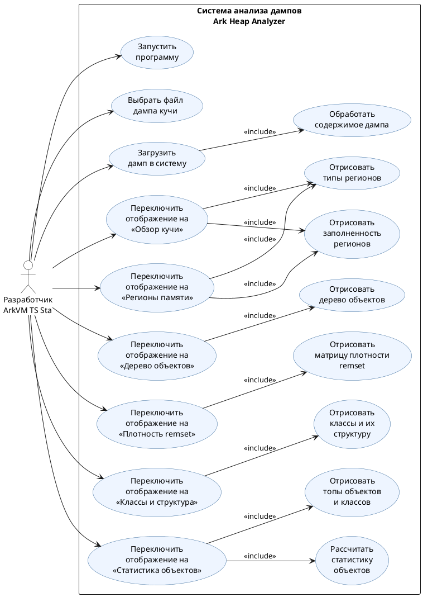

```plantuml
@startuml
left to right direction
skinparam packageStyle rectangle
skinparam usecase {
  BackgroundColor #EEF5FF
  BorderColor #336699
}
skinparam actor {
  BackgroundColor #FFFFFF
  BorderColor #000000
}

actor "Разработчик\nArkVM TS Sta" as Dev

rectangle "Система анализа дампов\nArk Heap Analyzer" as System {

  ' Загрузка и выбор данных
  usecase "Запустить\nпрограмму" as UC_RunApp
  usecase "Выбрать файл\nдампа кучи" as UC_SelectDumpFile
  usecase "Загрузить\nдамп в систему" as UC_LoadDump

  ' Переключение представлений
  usecase "Переключить\nотображение на\n«Обзор кучи»" as UC_ViewOverview
  usecase "Переключить\nотображение на\n«Регионы памяти»" as UC_ViewRegions
  usecase "Переключить\nотображение на\n«Дерево объектов»" as UC_ViewObjectTree
  usecase "Переключить\nотображение на\n«Плотность remset»" as UC_ViewRemsets
  usecase "Переключить\nотображение на\n«Классы и структура»" as UC_ViewClasses
  usecase "Переключить\nотображение на\n«Статистика объектов»" as UC_ViewObjectStats

  ' Внутренние функции системы (непосредственно инструмент)
  usecase "Обработать\nсодержимое дампа" as UC_ParseDump
  usecase "Отрисовать\nзаполненность\nрегионов" as UC_DrawRegionOccupancy
  usecase "Отрисовать\nтипы регионов" as UC_DrawRegionTypes
  usecase "Отрисовать\nдерево объектов" as UC_DrawObjectTree
  usecase "Отрисовать\nматрицу плотности\nremset" as UC_DrawRemsetMatrix
  usecase "Отрисовать\nклассы и их\nструктуру" as UC_DrawClasses
  usecase "Рассчитать\nстатистику\nобъектов" as UC_CalcObjectStats
  usecase "Отрисовать\nтопы объектов\nи классов" as UC_DrawObjectStats
}

' ДЕЙСТВИЯ РАЗРАБОТЧИКА
Dev --> UC_RunApp
Dev --> UC_SelectDumpFile
Dev --> UC_LoadDump

Dev --> UC_ViewOverview
Dev --> UC_ViewRegions
Dev --> UC_ViewObjectTree
Dev --> UC_ViewRemsets
Dev --> UC_ViewClasses
Dev --> UC_ViewObjectStats

' ВНУТРЕННИЕ ЗАВИСИМОСТИ ВНУТРИ СИСТЕМЫ

' Загрузка → парсинг
UC_LoadDump --> UC_ParseDump : <<include>>

' Обзор кучи
UC_ViewOverview --> UC_DrawRegionOccupancy : <<include>>
UC_ViewOverview --> UC_DrawRegionTypes     : <<include>>

' Регионы
UC_ViewRegions --> UC_DrawRegionOccupancy  : <<include>>
UC_ViewRegions --> UC_DrawRegionTypes      : <<include>>

' Дерево объектов
UC_ViewObjectTree --> UC_DrawObjectTree    : <<include>>

' Remsets
UC_ViewRemsets --> UC_DrawRemsetMatrix     : <<include>>

' Классы
UC_ViewClasses --> UC_DrawClasses          : <<include>>

' Статистика объектов
UC_ViewObjectStats --> UC_CalcObjectStats  : <<include>>
UC_ViewObjectStats --> UC_DrawObjectStats  : <<include>>

@enduml

```

