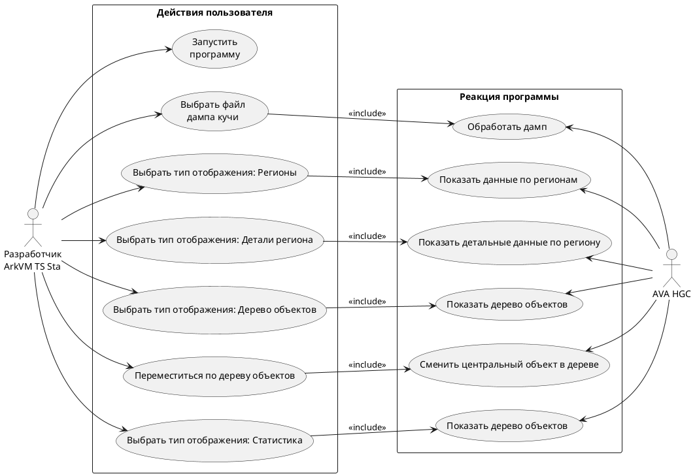

```plantuml
@startuml
left to right direction

actor "Разработчик\nArkVM TS Sta" as Dev

actor "AVA HGC" as App


rectangle "Действия пользователя" {
usecase "Запустить\nпрограмму" as RunApp

usecase "Выбрать файл\nдампа кучи" as SelectDumpFile
usecase "Выбрать тип отображения: Регионы" as im_Regions
usecase "Выбрать тип отображения: Детали региона" as im_DRegion
usecase "Выбрать тип отображения: Дерево объектов" as im_HeapTree
usecase "Переместиться по дереву объектов" as MoveInHeapTree
usecase "Выбрать тип отображения: Статистика" as im_Statistic
}

rectangle "Реакция программы" {
usecase "Обработать дамп" as ProcDumpFile
usecase "Показать данные по регионам" as ShowRegions
usecase "Показать детальные данные по региону" as ShowDRegion
usecase "Показать дерево объектов" as ShowObjectTree
usecase "Сменить центральный объект в дереве" as MoveInHeapTreeApp
usecase "Показать дерево объектов" as ShowStatistic
}


Dev --> RunApp
Dev --> SelectDumpFile
Dev --> im_Regions
Dev --> im_HeapTree
Dev --> MoveInHeapTree
Dev --> im_DRegion
Dev --> im_Statistic


SelectDumpFile --> ProcDumpFile: <<include>>
im_Regions --> ShowRegions: <<include>>
im_HeapTree --> ShowObjectTree: <<include>>
MoveInHeapTree -->MoveInHeapTreeApp : <<include>>
im_DRegion --> ShowDRegion: <<include>>
im_Statistic --> ShowStatistic: <<include>>

ProcDumpFile <-- App 
ShowRegions <-- App 
ShowDRegion <-- App 
ShowObjectTree <-- App 
MoveInHeapTreeApp <-- App 
ShowStatistic <-- App 


@enduml
```
