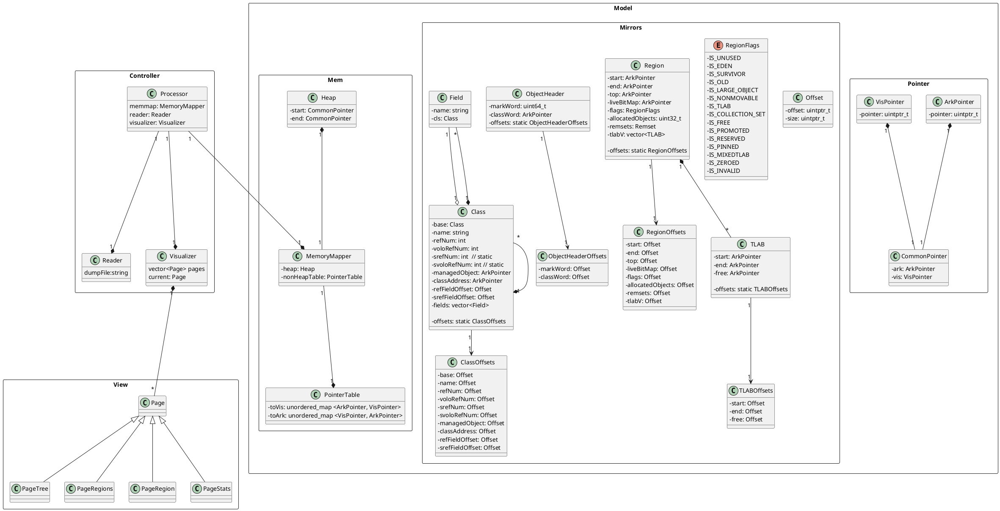

```plantuml
@startuml
skinparam classAttributeIconSize 0


rectangle "View" {
	class Page

	class PageTree
	class PageRegions
	class PageRegion
	class PageStats
}

rectangle "Model"{
	rectangle "Pointer" {
		class ArkPointer{ 
			-pointer: uintptr_t
		}
		class VisPointer{
			-pointer: uintptr_t
		}
		class CommonPointer{
			-ark: ArkPointer
			-vis: VisPointer
		}
	}
	rectangle "Mem"{
		class Heap{
			-start: CommonPointer
			-end: CommonPointer
		}
		class PointerTable{
			-toVis: unordered_map <ArkPointer, VisPointer> 
			-toArk: unordered_map <VisPointer, ArkPointer> 
		}
		class MemoryMapper{
			-heap: Heap
			-nonHeapTable: PointerTable
		}
	}
	rectangle "Mirrors" {
		class Offset {
			-offset: uintptr_t
			-size: uintptr_t
		}
		enum RegionFlags {
			-IS_UNUSED
			-IS_EDEN
			-IS_SURVIVOR
			-IS_OLD
			-IS_LARGE_OBJECT
			-IS_NONMOVABLE
			-IS_TLAB
			-IS_COLLECTION_SET
			-IS_FREE
			-IS_PROMOTED
			-IS_RESERVED
			-IS_PINNED
			-IS_MIXEDTLAB
			-IS_ZEROED
			-IS_INVALID
		}
		class Region {
			-start: ArkPointer
			-end: ArkPointer
			-top: ArkPointer
			-liveBitMap: ArkPointer
			-flags: RegionFlags
			-allocatedObjects: uint32_t
			-remsets: Remset
			-tlabV: vector<TLAB>

			-offsets: static RegionOffsets
		}
		class RegionOffsets{
			-start: Offset
			-end: Offset
			-top: Offset
			-liveBitMap: Offset
			-flags: Offset
			-allocatedObjects: Offset
			-remsets: Offset
			-tlabV: Offset
		}
		class ObjectHeader {
			-markWord: uint64_t
			-classWord: ArkPointer
			-offsets: static ObjectHeaderOffsets
		}
		class ObjectHeaderOffsets{
			-markWord: Offset
				-classWord: Offset
		}
		class TLAB {
			-start: ArkPointer
			-end: ArkPointer
			-free: ArkPointer

			-offsets: static TLABOffsets
		}
		class TLABOffsets {
			-start: Offset
			-end: Offset
			-free: Offset
		}
		class Field {
			-name: string
			-cls: Class
		}
		class Class {
			-base: Class
			-name: string
			-refNum: int
			-voloRefNum: int
			-srefNum: int  // static
			-svoloRefNum: int // static
			-managedObject: ArkPointer
			-classAddress: ArkPointer
			-refFieldOffset: Offset
			-srefFieldOffset: Offset
			-fields: vector<Field>

			-offsets: static ClassOffsets
		}
		class ClassOffsets {
			-base: Offset
			-name: Offset
			-refNum: Offset
			-voloRefNum: Offset
			-srefNum: Offset
			-svoloRefNum: Offset
			-managedObject: Offset
			-classAddress: Offset
			-refFieldOffset: Offset
			-srefFieldOffset: Offset
		}
	}
}

rectangle "Controller" {
	class Reader{
		dumpFile:string
	}
	class Visualizer{
		vector<Page> pages
		current: Page
	}
	class Processor{
		memmap: MemoryMapper
		reader: Reader
		visualizer: Visualizer
	}
}

Region "1" *-- "*" TLAB 

Class "1" *-- "*" Field
Class "*" --* "1" Class

Field "1" --o "1" Class 

ArkPointer "1" *-- "1" CommonPointer 
VisPointer "1" *-- "1" CommonPointer 

Heap "1" *-- "1" MemoryMapper 
MemoryMapper "1" --* "1" PointerTable 

Processor "1" --* "1" Reader 
Processor "1" --* "1" Visualizer 
Processor "1" --* "1" MemoryMapper 

Visualizer "1" *-- "*" Page 

Page <|-- PageTree
Page <|-- PageRegions  
Page <|-- PageRegion
Page <|-- PageStats

Region "1" --> "1" RegionOffsets 
ObjectHeader "1" --> "1" ObjectHeaderOffsets 
TLAB "1" --> "1" TLABOffsets 
Class "1" --> "1" ClassOffsets 

@enduml
```
